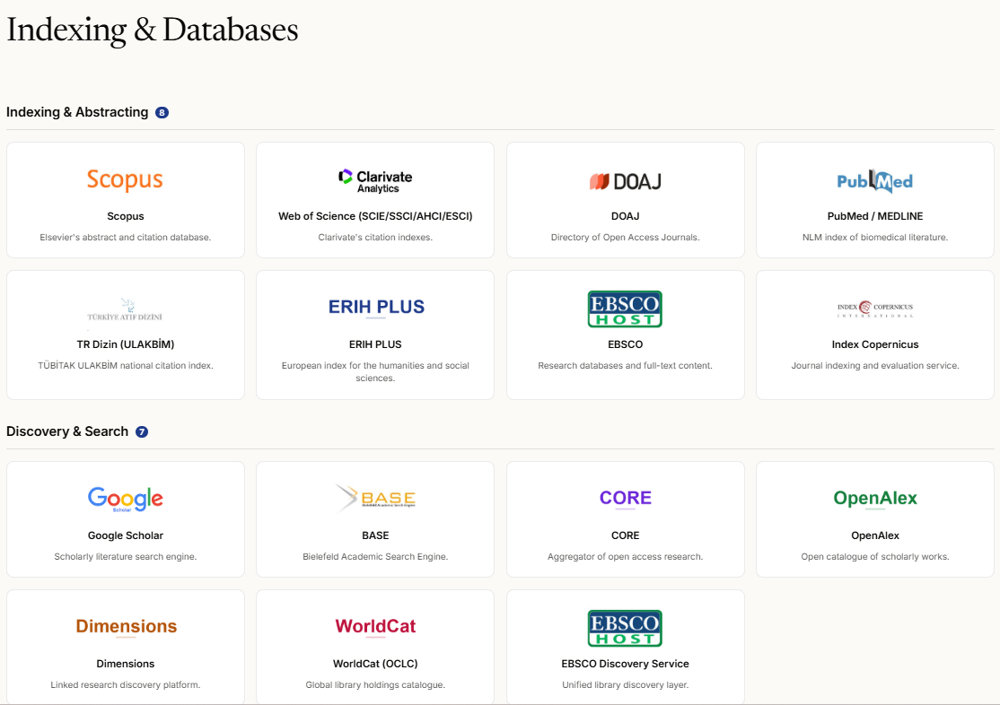
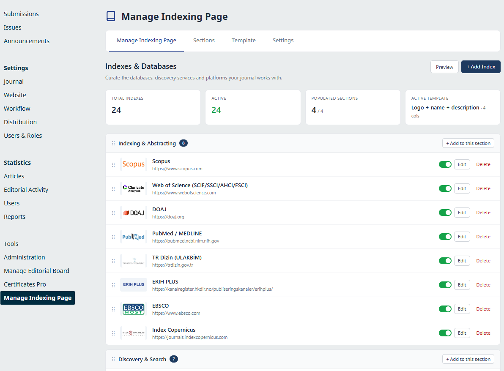
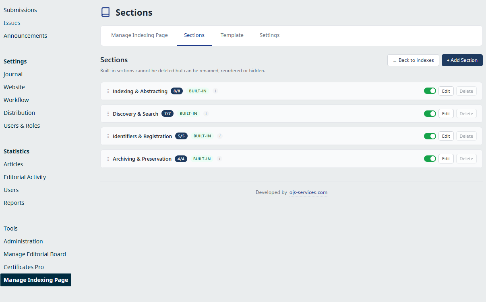
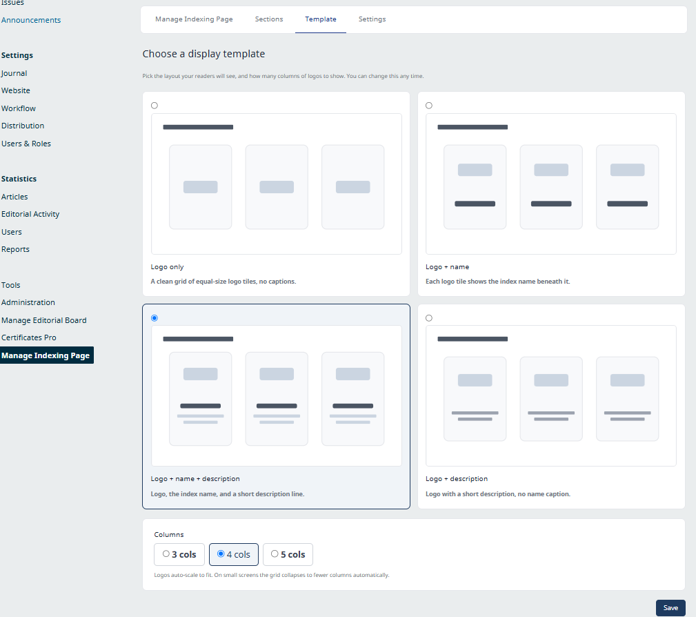
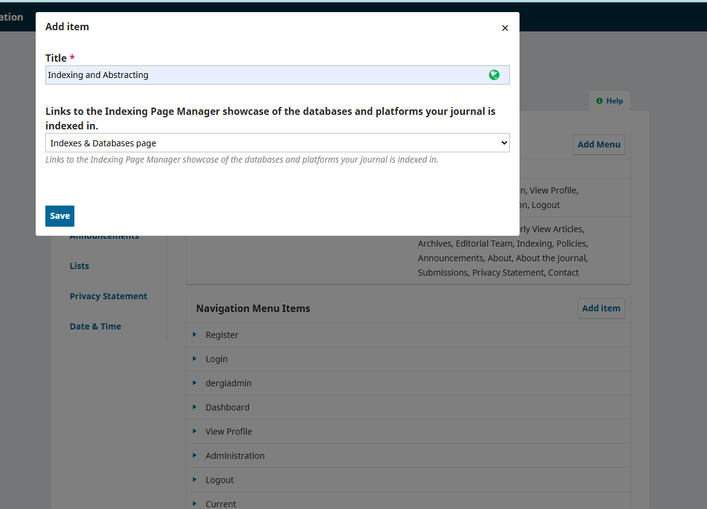

# Indexing Page Manager

A **free** OJS 3.3 plugin that lets your journal display the databases, indexes and services it is listed in — Scopus, Web of Science, DOAJ, TR Dizin, PubMed, Crossref and more — as a clean, professional **logo gallery**.

Everything is managed from your journal's admin panel. **No coding knowledge required.**

**English** · [Türkçe ↓](#türkçe)

---

## Screenshots

**The public page your readers see**

**Manage your indexes from the admin panel** — add, edit, reorder (drag & drop) and show/hide.

**Four ready-made categories**, plus any custom sections you add.

**Pick a layout and column count** — change it any time.

**A ready-made menu item** lets you add the page to your site menu in one step.

---

## Features

- **A logo gallery of your indexes** — add each one with its logo, name, a short description and a link.
- **Four ready-made categories** — *Indexing & Abstracting, Discovery & Search, Identifiers & Registration, Archiving & Preservation* — plus your own custom sections.
- **Managed entirely from the admin panel** — add, edit, show/hide and reorder by drag-and-drop. No coding knowledge required.
- **Layout choices** — four display styles (logos only / logo + name / logo + name + description / logo + description) and 3, 4 or 5 columns.
- **Fits your theme** — looks at home in any OJS theme, with a centred page title and a mobile-friendly layout.
- **A ready public page** — e.g. `/about/databases`, which you can rename and add to your menu with one click using the built-in menu item.
- **Bilingual** — ships with English and Turkish, and works on multilingual journals.
- **Search-engine friendly** — adds structured data so search engines understand where your journal is indexed.

## Requirements

- OJS **3.3.0.x**
- PHP **7.4 – 8.2**
- MySQL / MariaDB
- Works on single- and multi-journal installations

## Installation

**From the journal (recommended):** *Settings → Website → Plugins → Upload a New Plugin* → select the `.tar.gz` → **Enable**.

**Manually:** unzip into `plugins/generic/indexingPageManager`, then enable it under *Plugins*.

## Usage

After enabling, an **Indexing Page** entry appears in your admin sidebar. Add your indexes and arrange them there.

Your public page is available at `/about/databases` (you can change the address). To put it in your site navigation, go to *Settings → Website → Setup → Navigation Menus → Add Item* and choose the ready-made **“Indexes & Databases page”** item — no manual link needed.

## Works with every theme

The plugin works on **any OJS 3.3 theme**. It was designed alongside our **Atlas** theme, where your index logos can also appear as a block on the journal homepage. See our themes: [ojs-services.com/ojs-themes](https://ojs-services.com/ojs-themes/)

Theme authors can embed the gallery anywhere with the `{ipm_blocks}` template function.

## License

Free and open-source under the **GNU GPL v2**.

## Developed by

**OJS Services** — [ojs-services.com](https://ojs-services.com) · info@ojs-services.com

---

# Türkçe

Derginizin yer aldığı dizin, veritabanı ve servisleri — Scopus, Web of Science, DOAJ, TR Dizin, PubMed, Crossref ve daha fazlası — şık ve profesyonel bir **logo galerisi** olarak gösteren **ücretsiz** OJS 3.3 eklentisi.

Her şey derginizin yönetim panelinden yönetilir. **Kod bilgisi gerektirmez.**

> Ekran görüntüleri için [yukarıya bakın ↑](#screenshots) (arayüz aynıdır).

## Özellikler

- **Dizinlerinizin logo galerisi** — her birini logosu, adı, kısa açıklaması ve bağlantısıyla ekleyin.
- **Hazır dört kategori** — *Dizinleme ve Özetleme, Keşif ve Arama, Tanımlayıcılar ve Kayıt, Arşivleme ve Koruma* — ayrıca kendi özel bölümleriniz.
- **Tamamen panelden yönetim** — ekleme, düzenleme, gösterme/gizleme ve sürükle-bırak ile sıralama. Kod bilgisi gerektirmez.
- **Görünüm seçenekleri** — dört şablon (yalnız logo / logo + ad / logo + ad + açıklama / logo + açıklama) ve 3, 4 veya 5 sütun.
- **Temanıza uyum** — her OJS temasında doğal durur; başlık ortalanır, mobil uyumludur.
- **Hazır bir genel sayfa** — örn. `/about/databases`; adını değiştirebilir, hazır menü öğesiyle tek tıkla menünüze ekleyebilirsiniz.
- **İki dilli** — İngilizce ve Türkçe ile gelir; çok dilli dergilerde çalışır.
- **Arama motoru dostu** — derginizin nerede dizinlendiğini arama motorlarının anlaması için yapılandırılmış veri ekler.

## Gereksinimler

- OJS **3.3.0.x**
- PHP **7.4 – 8.2**
- MySQL / MariaDB
- Tek ve çok dergili kurulumlarda çalışır

## Kurulum

**Dergiden (önerilen):** *Ayarlar → Web Sitesi → Eklentiler → Yeni Eklenti Yükle* → `.tar.gz` dosyasını seçin → **Etkinleştir**.

**Elle:** `plugins/generic/indexingPageManager` klasörüne açın, ardından *Eklentiler* altından etkinleştirin.

## Kullanım

Etkinleştirince yönetim menünüzde **İndeksleme Sayfası** girişi belirir. Dizinlerinizi oradan ekleyip düzenlersiniz.

Genel sayfanız `/about/databases` adresindedir (adresi değiştirebilirsiniz). Menünüze eklemek için *Ayarlar → Web Sitesi → Kurulum → Gezinme Menüleri → Öğe Ekle* yolunu izleyip hazır **“İndeksler ve Veritabanları sayfası”** öğesini seçin — elle bağlantı eklemenize gerek yok.

## Tüm temalarla çalışır

Eklenti **her OJS 3.3 temasında** çalışır. **Atlas** temamızla birlikte tasarlanmıştır; Atlas'ta dizin logolarınız derginin anasayfasında bir blok olarak da görünebilir. Temalarımız: [ojs-services.com/ojs-themes](https://ojs-services.com/ojs-themes/)

Tema geliştiriciler galeriyi istedikleri yere `{ipm_blocks}` şablon fonksiyonuyla gömebilir.

## Lisans

**GNU GPL v2** kapsamında ücretsiz ve açık kaynak.

## Geliştiren

**OJS Services** — [ojs-services.com](https://ojs-services.com) · info@ojs-services.com
